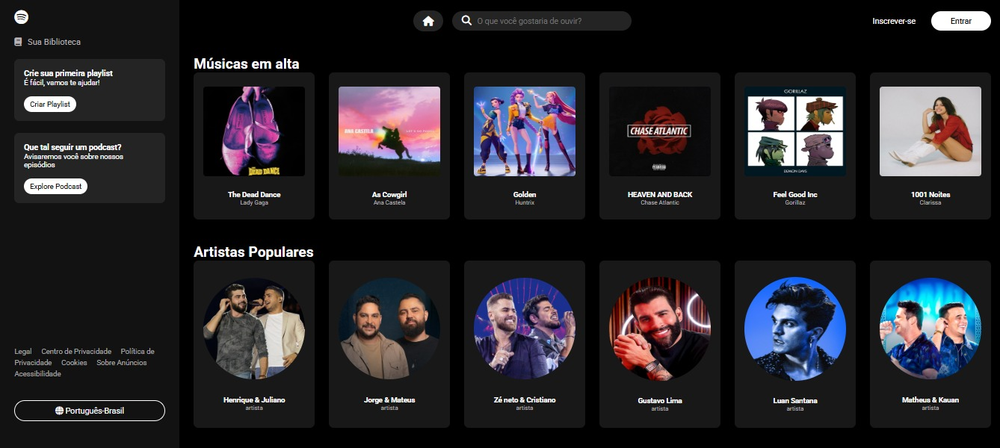

# 🎵 Spotify – Página Inicial (Clone)

Projeto Front-End inspirado na página inicial do Spotify, desenvolvido com foco em estrutura visual e renderização dinâmica de dados, priorizando a organização do layout e a prática de JavaScript.

## 📸 Preview


## 🛠️ Tecnologias Utilizadas
- HTML5
- CSS3
- JavaScript
- Font Awesome (ícones)

## ⚙️ Funcionalidades
- Renderização dinâmica de músicas, artistas, álbuns e rádios  
- Estrutura visual inspirada na interface do Spotify  
- Criação dinâmica de cards via JavaScript  
- Uso de ícones para enriquecer a interface  

## 📚 Objetivo do Projeto
Projeto desenvolvido com fins educacionais, com o objetivo de praticar:
- Estruturação de layouts complexos  
- Manipulação do DOM com JavaScript  
- Organização de dados em arrays e renderização dinâmica  
- Separação de responsabilidades entre HTML, CSS e JavaScript  
- Uso de bibliotecas externas (Font Awesome)  

## 🚀 Como executar o projeto
```bash
# Clone o repositório
git clone https://github.com/mellacer/Spotify-Page

# Acesse a pasta do projeto
cd Spotify-Page

# Abra o arquivo index.html no navegador
